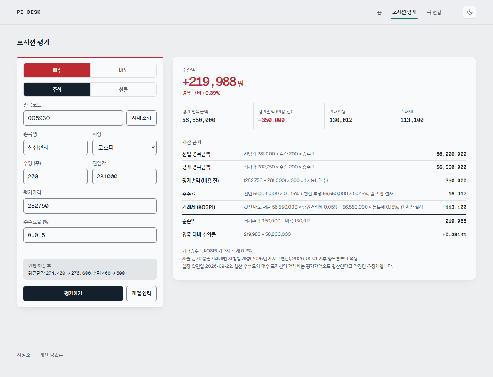
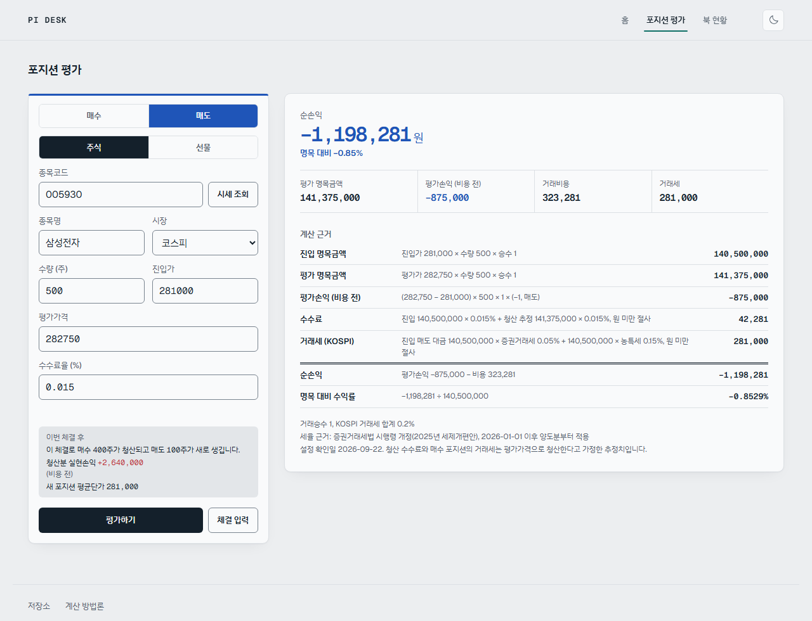
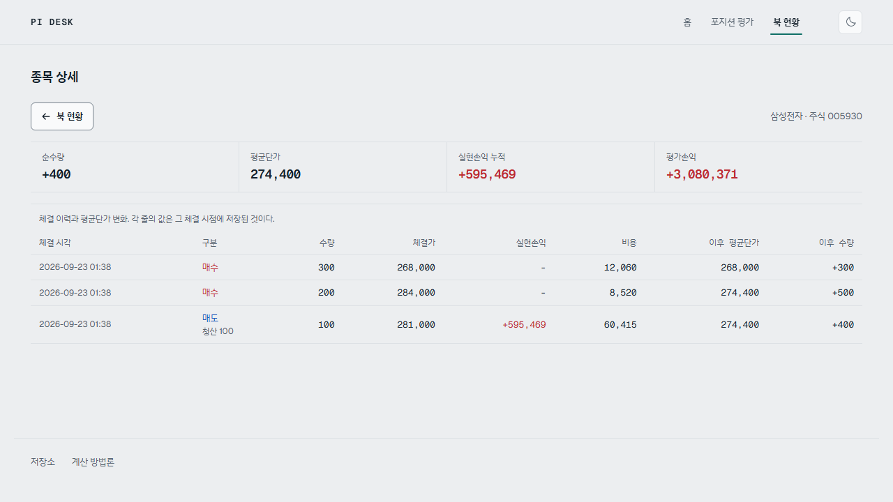

# PI 데스크 포지션 평가 엔진

증권사 자기매매(PI) 포지션의 시가평가·손익·거래비용·리스크 한도를 계산하고,
모든 결과 숫자 옆에 산식과 대입값을 함께 보여주는 웹 도구입니다.


## 주요 기능
- **체결 기반 포지션 관리**: 포지션을 직접 만들지 않고 체결을 쌓으면 평균단가와 실현손익이 따라온다.
  분할 매수, 부분 청산, 방향 전환이 자연스럽게 처리된다(이동평균법)
- **종목 상세**: 체결 이력과 평균단가가 어떻게 움직였는지 한 줄씩. 값은 체결 시점에 저장된 것이다
- **일별 스냅샷**: 하루 한 번 저장하고 손익 추이를 본다. 덮어쓰지 않으며, 다시 찍으면 정정본이 새 행으로 남는다
- **주식·선물 포지션 평가**: 평가손익, 수수료, 2026년 기준 증권거래세, 순손익, 수익률, 선물 증거금
- **계산 근거 표**: 각 단계의 산식·대입값·결과를 한 줄씩 표시. 좁은 화면에서도 숨기지 않습니다
- **근거 추적**: 계산 근거 줄에 마우스를 올리거나 키보드로 포커스하면, 그 값이 쓴 입력 칸과
  적용된 설정값이 전표에서 함께 강조됩니다. 반대 방향도 동작합니다.
  의존 관계는 엔진이 `TraceStep.inputs`로 알려주고 화면은 추측하지 않습니다
- **실시간 평가**: 전표 입력이 유효해지면 자동으로 다시 계산합니다. `평가하기`는 명시적 재평가용입니다
- **북 현황**: 포지션 저장, 일괄 재평가(주식은 무료 시세 자동 조회), 총노출·순노출, 한도 점검
- **한도 사용률**: 총노출·손실·단일 포지션 한도 대비 사용률. 백엔드가 Decimal로 계산합니다
- **엔진·SQL 대사**: Python 집계와 SQL 뷰 집계가 일치하는지 매번 자동 확인
- **감사추적**: 평가 이력은 수정·삭제 불가(DB 트리거)
- **라이트·다크 모드**: 시스템 설정을 따르고 수동 전환도 됩니다. 두 모드 모두 WCAG AA 대비를 지킵니다

## 기술 스택
Python · FastAPI · SQLite(직접 SQL, 윈도 함수 뷰) · pykrx · pytest
React 19 · TypeScript · Vite · Motion · Phosphor Icons · 네이티브 CSS 토큰(Tailwind 없음)

## 실행 방법 (Windows)
```powershell
# 백엔드
cd backend
python -m venv .venv
.venv\Scripts\python -m pip install -r requirements.txt
.venv\Scripts\python -m pytest
.venv\Scripts\python -m uvicorn app.main:app --reload --port 8000

# 프론트 (새 터미널)
cd frontend
npm install
npm run dev
```
http://localhost:5173 에 접속합니다.

## 시연용 예시 북 만들기

빈 화면 대신 포지션이 채워진 상태를 보려면 시드 스크립트를 실행합니다.
FastAPI TestClient로 앱을 프로세스 안에서 호출하므로 **서버를 띄우지 않아도 되고**,
요청이 실제 API를 그대로 지나가 호가단위 검증 같은 규칙이 모두 적용됩니다.

```powershell
cd backend
.venv\Scripts\python -m scripts.seed_demo
```

삼성전자를 두 번에 나눠 사고(평균단가 274,400) 일부를 되팔아 **실현손익이 생긴 상태**를 만듭니다.
여기에 코스닥 주식 매도, 코스피200 선물 매도, 미니 코스피200 선물 매수를 더해
재평가와 스냅샷을 한 번씩 실행합니다. 이미 열린 포지션이 있으면 아무것도 하지 않으므로
여러 번 실행해도 안전합니다. 초기화하려면 `backend/data/trading.db`를 지우고 다시 실행하세요.

> **체결가와 선물 평가가격은 예시값입니다.** 실제 체결가나 정산가가 아닙니다.
> 주식 평가가격만 무료 시세(pykrx → FinanceDataReader)에서 실제 종가를 받아옵니다.
> 이 북은 화면을 보여주기 위한 것이지 손익을 주장하기 위한 것이 아닙니다.

## 화면

전표에 값을 넣으면 순손익과 함께 **그 숫자가 나온 산식**이 오른쪽에 그대로 나옵니다.
아래는 삼성전자 100주를 250,000에 사서 277,500에 평가한 경우입니다.

| | 라이트 | 다크 |
|---|---|---|
| 포지션 평가 |  |  |
| 북 현황 |  |  |

북 현황에서는 **확정(실현손익)과 미확정(평가손익)을 그룹 헤더와 1px 세로선으로 갈라** 둡니다.
성격이 다른 숫자라 한데 섞이면 안 되기 때문입니다.

### 근거 추적

계산 근거 줄에 마우스를 올리거나 키보드로 포커스하면, 그 값이 쓴 입력 칸이 전표에서 함께 강조됩니다.
아래는 `거래세 (KOSPI)` 줄을 잡은 모습입니다. 시장·수량·평가가격·방향이 강조되고
**진입가는 강조되지 않습니다.** 매수 포지션의 거래세는 청산 매도 대금(평가가격) 기준이기 때문입니다.
이 구분은 화면이 짐작한 것이 아니라 엔진이 `TraceStep.inputs`로 알려준 것입니다.


### 체결 입력과 평균단가 미리보기

이미 보유 중인 종목이면 이번 체결 후 평균단가와 수량이 어떻게 되는지 입력 단계에서 보여줍니다.
아래는 400주를 274,400에 들고 있는 상태에서 200주를 281,000에 더 사려는 경우로,
평균단가가 **274,400에서 276,600으로** 올라갑니다.
저장하지 않는 조회(`POST /api/trades/preview`)라 값을 고치는 동안 계속 갱신됩니다.



### 방향 전환 안내

보유 수량을 넘는 반대 방향 체결은 거절하지 않고 **방향 전환**으로 처리합니다(이동평균법 규칙 3).
다만 실수일 수 있으므로 청산되는 수량과 새로 생기는 수량을 입력 단계에서 알려줍니다.
경고가 아니라 확인이므로 오류 색을 쓰지 않습니다.



### 종목 상세: 평균단가가 어떻게 움직였나

체결 한 건이 한 줄입니다. 분할 매수로 268,000에서 274,400이 되고,
**부분 청산에서는 평균단가가 바뀌지 않는다**는 것이 그대로 보입니다(규칙 2).
각 줄의 값은 그 체결 시점에 저장된 것이라 지금 다시 계산하지 않습니다.



### 그 밖의 상태

빈 북, 로딩 스켈레톤, 입력 오류, 엔진·SQL 대사 결과를 포함한 전체 스크린샷은
[docs/screenshots](docs/screenshots)에 있습니다(3개 화면 x 1280/375 x 라이트/다크 + 상태 8종).

입력 오류에는 **빨강을 쓰지 않습니다.** 이 앱에서 빨강은 매수와 이익을 뜻하므로
빨간 오류 박스는 "이익"으로 오독될 여지가 있습니다. 오류와 경고는 오커 계열로 통일하고
아이콘과 위치로 구분합니다.

직접 다시 찍으려면 dev 서버를 띄운 상태에서 아래를 실행합니다(설치된 Chrome을 headless로 씁니다).

```powershell
cd backend
.venv\Scripts\python -m scripts.shoot_screenshots
.venv\Scripts\python -m scripts.shoot_states
```

빈 북과 로딩 스켈레톤은 **비어 있는 임시 DB를 띄운 백엔드**를 상대로 따로 찍습니다.
화면에서 응답을 가로채 흉내 내지 않습니다. 가짜 데이터로 만든 화면을 문서에 싣지 않기 위해서입니다.

## 기존 DB 이전

체결 기반 구조로 바뀌기 전에 만든 DB가 있다면 한 번 옮겨야 합니다.

```powershell
cd backend
.venv\Scripts\python -m scripts.migrate_to_trades
```

DB를 `.bak`으로 백업한 뒤 기존 포지션을 체결 1건씩으로 바꿉니다.
포지션 id를 보존하므로 기존 평가 이력(`valuations`)이 그대로 유효합니다.
이미 옮긴 DB에 다시 실행하면 아무것도 하지 않습니다.

## 계산 근거
산식, 세율 출처, 손계산 예시는 [METHODOLOGY.md](METHODOLOGY.md)에 있습니다.
테스트의 기대값은 모두 이 문서의 손계산 값입니다.

## 디자인 시스템
색·글꼴·간격·모션의 결정과 근거는 [DESIGN.md](DESIGN.md)에 있습니다.
라이트·다크 팔레트의 대비는 42개 조합을 계산해 전부 WCAG AA를 통과시켰습니다.

## 저장소
https://github.com/HWGfactory/trading-risk-engine

## 로드맵
옵션(블랙-숄즈·그릭스), 채권(듀레이션·DV01), 북 VaR, Claude API 리스크 코멘트, MCP 서버화
