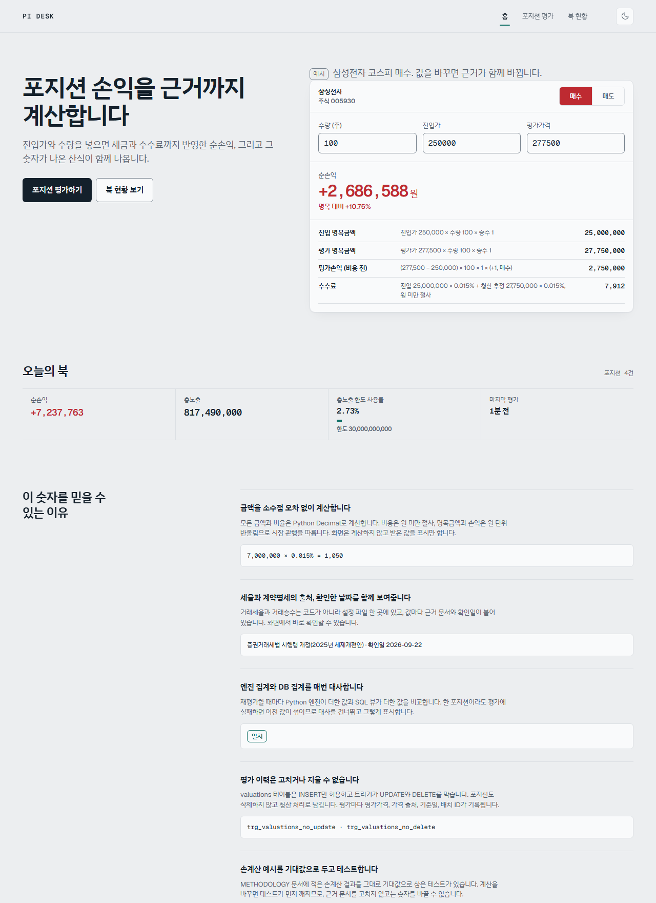
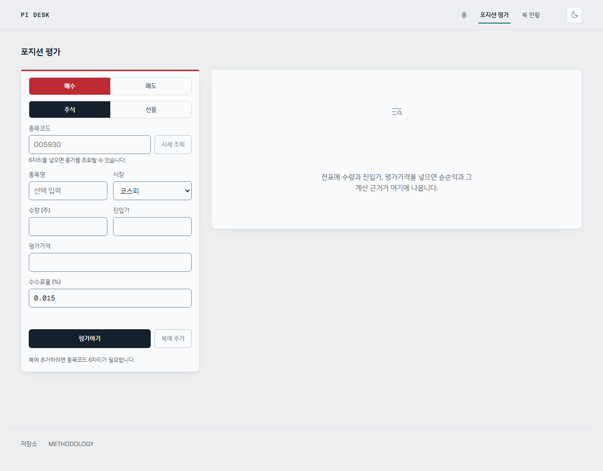
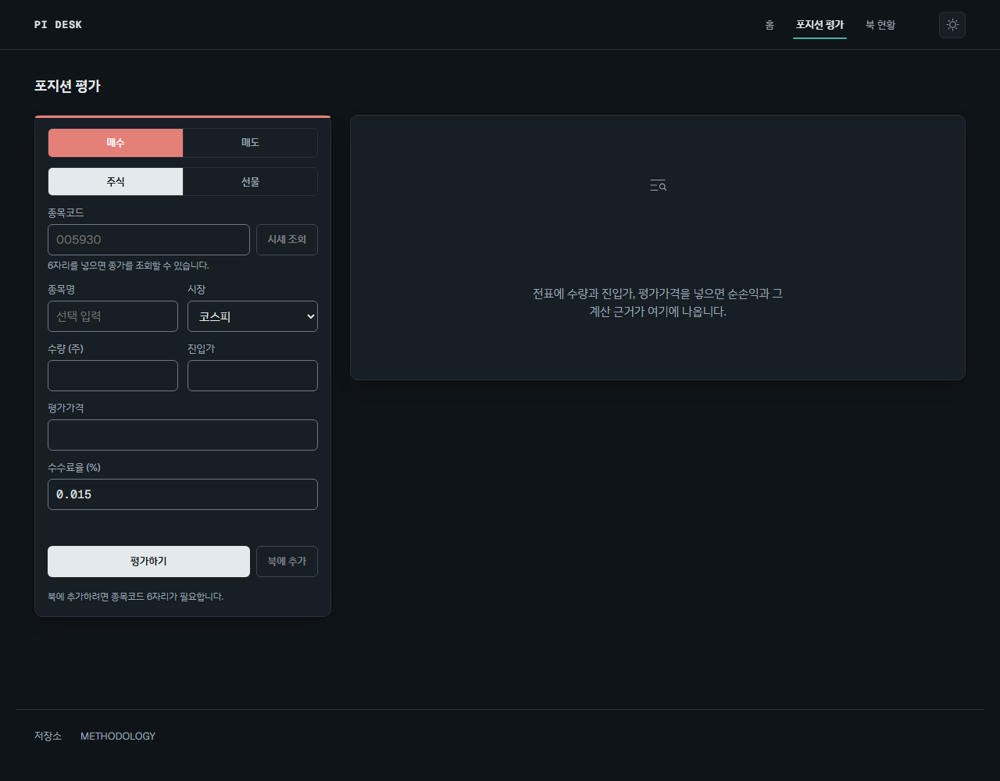
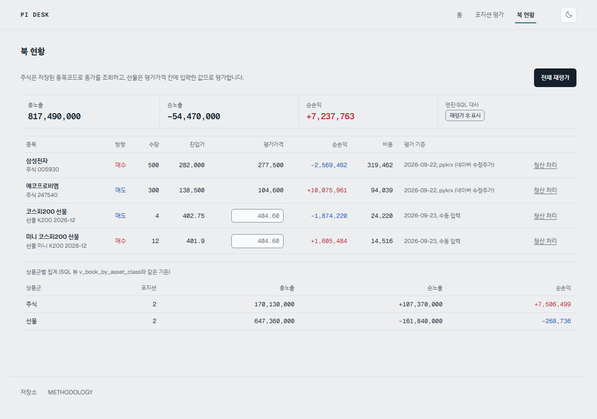
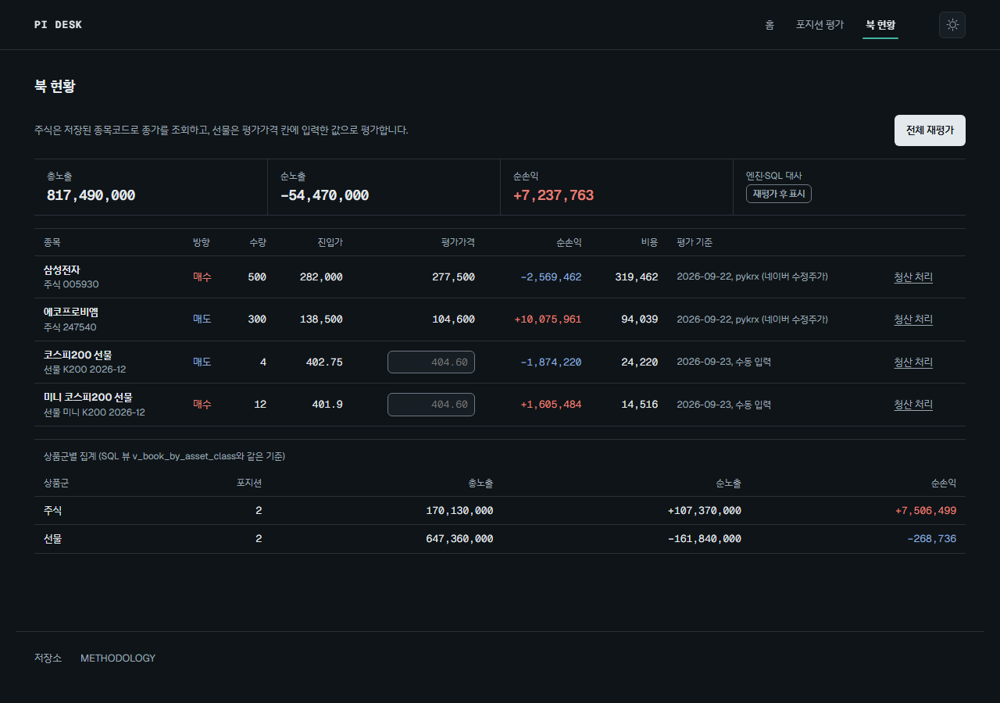
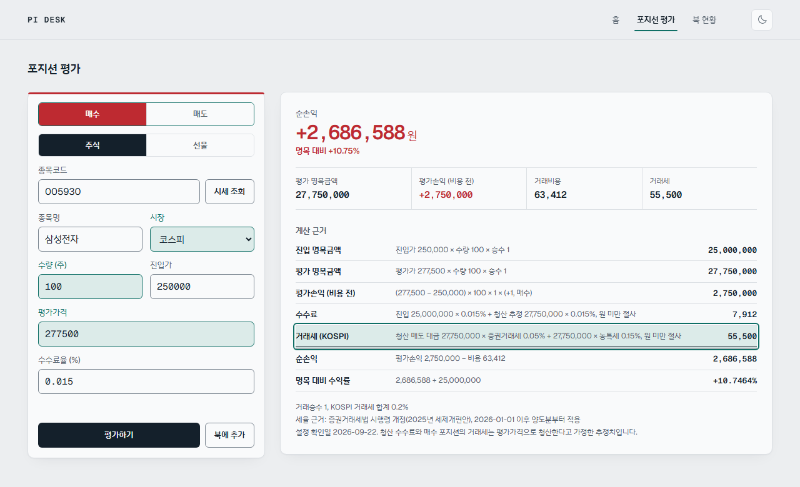

# PI 데스크 포지션 평가 엔진

증권사 자기매매(PI) 포지션의 시가평가·손익·거래비용·리스크 한도를 계산하고,
모든 결과 숫자 옆에 산식과 대입값을 함께 보여주는 웹 도구입니다.



## 주요 기능
- **주식·선물 포지션 평가**: 평가손익, 수수료, 2026년 기준 증권거래세, 순손익, 수익률, 선물 증거금
- **계산 근거 표**: 각 단계의 산식·대입값·결과를 한 줄씩 표시. 좁은 화면에서도 숨기지 않습니다
- **근거 추적**: 계산 근거 줄에 마우스를 올리거나 키보드로 포커스하면, 그 값이 쓴 입력 칸과
  적용된 설정값이 전표에서 함께 강조됩니다. 반대 방향도 동작합니다.
  의존 관계는 엔진이 `TraceStep.inputs`로 알려주고 화면은 추측하지 않습니다
- **실시간 평가**: 전표 입력이 유효해지면 자동으로 다시 계산합니다. `평가하기`는 명시적 재평가용입니다
- **북 현황**: 포지션 저장, 일괄 재평가(주식은 무료 시세 자동 조회), 총노출·순노출, 한도 점검
- **한도 사용률**: 총노출·손실·단일 포지션 한도 대비 사용률. 백엔드가 Decimal로 계산합니다
- **엔진·SQL 대사**: Python 집계와 SQL 뷰 집계가 일치하는지 매번 자동 확인
- **감사추적**: 평가 이력은 수정·삭제 불가(DB 트리거)
- **라이트·다크 모드**: 시스템 설정을 따르고 수동 전환도 됩니다. 두 모드 모두 WCAG AA 대비를 지킵니다

## 기술 스택
Python · FastAPI · SQLite(직접 SQL, 윈도 함수 뷰) · pykrx · pytest
React 19 · TypeScript · Vite · Motion · Phosphor Icons · 네이티브 CSS 토큰(Tailwind 없음)

## 실행 방법 (Windows)
```powershell
# 백엔드
cd backend
python -m venv .venv
.venv\Scripts\python -m pip install -r requirements.txt
.venv\Scripts\python -m pytest
.venv\Scripts\python -m uvicorn app.main:app --reload --port 8000

# 프론트 (새 터미널)
cd frontend
npm install
npm run dev
```
http://localhost:5173 에 접속합니다.

## 시연용 예시 북 만들기

빈 화면 대신 포지션이 채워진 상태를 보려면 시드 스크립트를 실행합니다.
FastAPI TestClient로 앱을 프로세스 안에서 호출하므로 **서버를 띄우지 않아도 되고**,
요청이 실제 API를 그대로 지나가 호가단위 검증 같은 규칙이 모두 적용됩니다.

```powershell
cd backend
.venv\Scripts\python -m scripts.seed_demo
```

코스피 주식 매수, 코스닥 주식 매도, 코스피200 선물 매도, 미니 코스피200 선물 매수
네 건을 만들고 재평가를 한 번 실행합니다. 이미 열린 포지션이 있으면 아무것도 하지 않으므로
여러 번 실행해도 안전합니다. 초기화하려면 `backend/data/trading.db`를 지우고 다시 실행하세요.

> **진입가와 선물 평가가격은 예시값입니다.** 실제 체결가나 정산가가 아닙니다.
> 주식 평가가격만 무료 시세(pykrx → FinanceDataReader)에서 실제 종가를 받아옵니다.
> 이 북은 화면을 보여주기 위한 것이지 손익을 주장하기 위한 것이 아닙니다.

## 화면

| | 라이트 | 다크 |
|---|---|---|
| 포지션 평가 |  |  |
| 북 현황 |  |  |

근거 추적을 켠 모습입니다. `거래세 (KOSPI)` 줄에 포커스하면 그 줄이 쓴 시장·수량·평가가격·방향만
강조되고, 진입가는 강조되지 않습니다. 매수 포지션의 거래세는 청산 매도 대금(평가가격) 기준이기
때문입니다.



모든 화면 스크린샷은 [docs/screenshots](docs/screenshots)에 있습니다.
직접 다시 찍으려면 dev 서버를 띄운 상태에서 아래를 실행합니다(설치된 Chrome을 headless로 씁니다).

```powershell
cd backend
.venv\Scripts\python -m scripts.shoot_screenshots
.venv\Scripts\python -m scripts.shoot_states
```

## 계산 근거
산식, 세율 출처, 손계산 예시는 [METHODOLOGY.md](METHODOLOGY.md)에 있습니다.
테스트의 기대값은 모두 이 문서의 손계산 값입니다.

## 디자인 시스템
색·글꼴·간격·모션의 결정과 근거는 [DESIGN.md](DESIGN.md)에 있습니다.
라이트·다크 팔레트의 대비는 42개 조합을 계산해 전부 WCAG AA를 통과시켰습니다.

## 로드맵
옵션(블랙-숄즈·그릭스), 채권(듀레이션·DV01), 북 VaR, Claude API 리스크 코멘트, MCP 서버화
